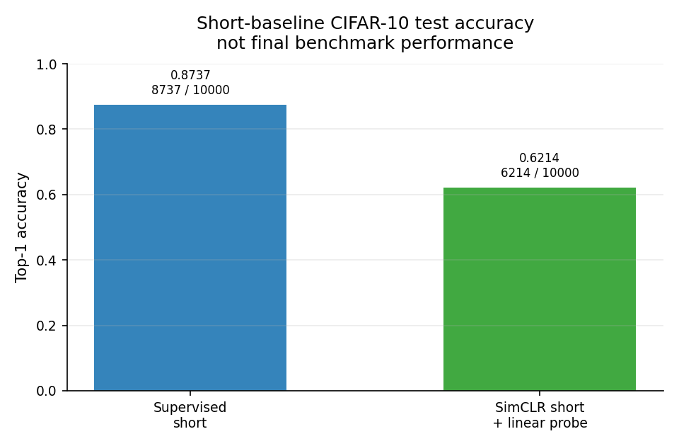
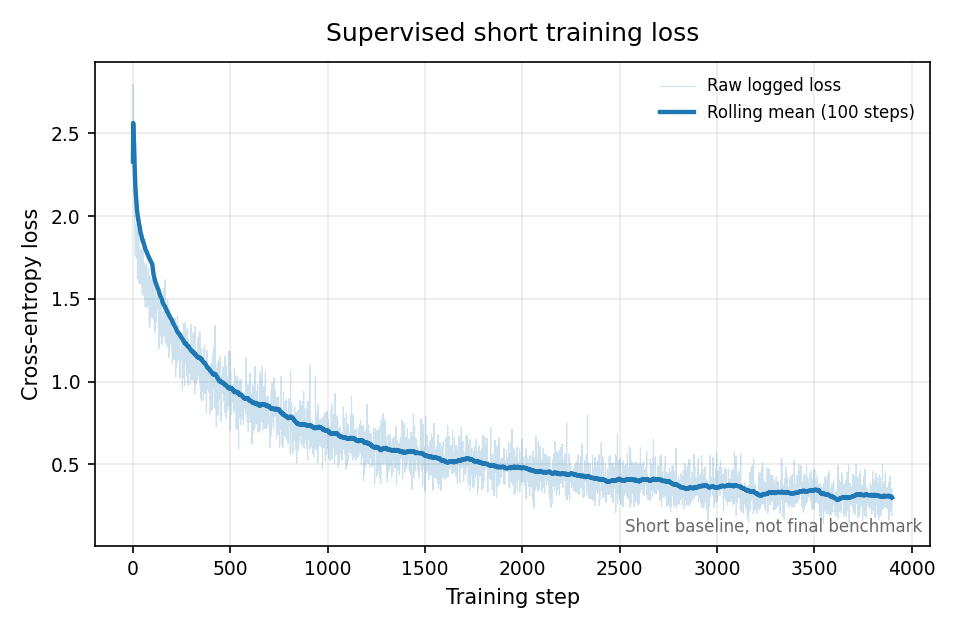
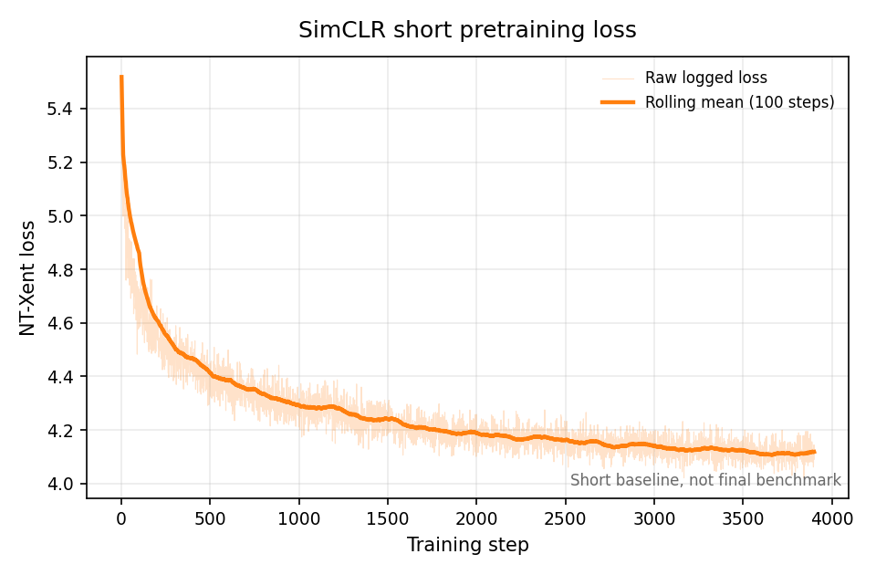
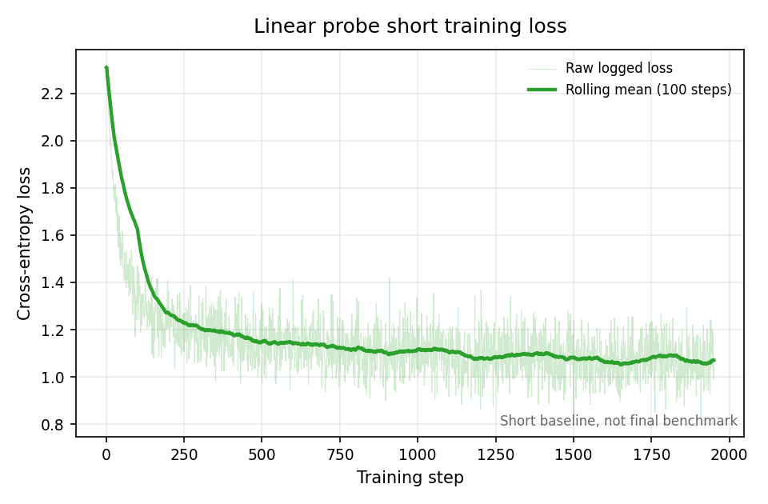

# SimCLR Reproduction and Ablation

README version: v0.3

## Overview

This repository is a compact PyTorch SimCLR reproduction and ablation project on
CIFAR-10.

It is a course and research-training style project. The goal is to practice
reproducible implementation, validation, experiment tracking, ablation analysis,
and honest result interpretation. It is intentionally small and does not claim
state-of-the-art or paper-scale SimCLR performance.

The project includes:

- CIFAR-10 data loading and two-crop augmentation;
- CIFAR-style ResNet18 encoder and projection head;
- NT-Xent contrastive loss;
- SimCLR pretraining;
- frozen-encoder linear probe training and evaluation;
- supervised ResNet18 short baseline;
- three short ablations: no projection head, weak augmentation, and batch size
  64 vs 128.

## Research Direction

SimCLR is used here as a practical entry point into contrastive representation
learning. The longer-term direction is to use the engineering workflow and
representation-learning foundation from this project as a stepping stone toward
later audio and audio-visual intelligence research.

This repository does not implement audio training, video processing,
Audio-SimCLR, CLAP, AV-HuBERT, ImageBind, or audio-visual synchronization.

## Current Status

- Core implementation is completed for the current short project scope.
- Short supervised baseline training and CIFAR-10 test evaluation are completed.
- Short SimCLR pretraining, short linear probe training, and CIFAR-10 test
  evaluation are completed.
- Three core short ablations are completed:
  - no projection head;
  - weak augmentation;
  - SimCLR pretraining batch size 64.
- Combined ablation summary table is completed.
- Next stage: Task 58 final report scaffold.

## Results

These are preliminary short-run CIFAR-10 test-set results. They are project-level
evidence for a small controlled workflow, not final benchmark results and not
paper-scale SimCLR comparisons.

The supervised short baseline is included as context only. It is not an ablation
row against SimCLR. The ablation baseline is:

```text
SimCLR short + linear probe Top-1 = 0.621400
```

| Run | CIFAR-10 test Top-1 | Correct / total | Delta vs SimCLR baseline | Notes |
|---|---:|---:|---:|---|
| Supervised short baseline | 0.873700 | 8737 / 10000 | N/A | Supervised reference only; not a SimCLR ablation row. |
| SimCLR short + linear probe | 0.621400 | 6214 / 10000 | 0.00 pp | Short SimCLR ablation baseline. |
| No projection | 0.594500 | 5945 / 10000 | -2.69 pp | Projection head disabled in this short SimCLR setup. |
| Weak augmentation | 0.356600 | 3566 / 10000 | -26.48 pp | Largest observed negative drop among completed short ablations. |
| Batch64 | 0.596100 | 5961 / 10000 | -2.53 pp | Fixed-epoch batch-size comparison, not fixed-optimizer-step comparison. |

Primary result records:

- `results/tables/short_baseline_results.md`
- `results/tables/combined_ablation_results.md`
- `results/tables/no_projection_ablation_results.md`
- `results/tables/augmentation_ablation_results.md`
- `results/tables/batch_size_ablation_results.md`

## Main Observations

- Weak augmentation shows the largest observed negative drop in the completed
  short ablations.
- No-projection and batch64 are both slightly lower than the SimCLR short
  baseline in this short setup.
- The batch64 result is especially preliminary because the comparison uses fixed
  epochs, not fixed optimizer steps; batch64 has more optimizer steps per epoch
  than batch128.
- These observations are preliminary project-level observations, not final
  scientific claims.

## Figures

Existing short-baseline figures:









The loss figures show raw logged curves plus smoothed trend lines for readability.
No CSV values were changed to create the figures.

## Repository Structure

```text
.
|-- README.md
|-- AGENTS.md
|-- environment.yml
|-- configs/
|-- src/
|-- tests/
|-- experiments/
|-- notes/
|-- results/
|   |-- figures/
|   |-- logs/
|   `-- tables/
|-- report/
`-- .github/
```

Important directories:

- `configs/`: experiment and evaluation configuration files.
- `src/`: dataset, augmentation, model, loss, training, evaluation, and plotting
  code.
- `tests/`: lightweight fake-data and unit tests.
- `experiments/`: task-by-task experiment and run records.
- `results/tables/`: small CSV and Markdown result tables.
- `results/logs/`: small CSV training logs.
- `results/figures/`: selected lightweight project figures.
- `notes/`: workflow logs, task registry, decisions, audits, and planning notes.

## Installation

Environment setup is controlled by the Human Owner. The project has been
developed with a local conda environment at:

```text
/home/yeyee/miniconda3/envs/simclr
```

The placeholder `environment.yml` should not be treated as a complete lock file.
Use the official PyTorch selector when recreating or changing the environment,
especially for CUDA-compatible `torch` and `torchvision` versions.

## How To Reproduce Current Checks

Environment and storage verification is recorded in:

```text
experiments/exp00_environment_check.md
```

Run the current lightweight test suite:

```bash
/home/yeyee/miniconda3/envs/simclr/bin/python -m pytest -q tests/test_dataset.py tests/test_model_shapes.py tests/test_nt_xent.py tests/test_simclr_integration.py tests/test_train_simclr_smoke.py tests/test_linear_probe_smoke.py tests/test_supervised_smoke.py tests/test_evaluate_smoke.py
```

Regenerate the short-baseline figures from existing logs and result CSVs:

```bash
/home/yeyee/miniconda3/envs/simclr/bin/python -m src.plot_training_curves
```

Training and evaluation commands for completed real runs are recorded in the
corresponding files under `experiments/`. They are not repeated here as casual
quick-start commands because they depend on external CIFAR-10 data and external
checkpoints.

Datasets and checkpoints are external artifacts and are not committed to this
repository.

## Storage Policy

Datasets, checkpoints, model weights, and large exports are stored outside the
Git repository.

Default external locations:

```text
Raw datasets:
/home/yeyee/research/03_datasets/SimCLR-Reproduction-and-Ablation

Models and checkpoints:
/home/yeyee/research/04_models/SimCLR-Reproduction-and-Ablation

Large exports:
/home/yeyee/research/05_exports/SimCLR-Reproduction-and-Ablation
```

The repository may contain source code, configs, tests, documentation, small CSV
logs, small result tables, and selected lightweight figures. It must not contain
datasets, `.pt`, `.pth`, `.ckpt`, `.onnx`, TensorBoard event files, W&B runs, or
large generated artifacts.

## Agent Workflow

Project workflow and guardrails are tracked in:

- `AGENTS.md`
- `PROJECT_STATUS.md`
- `notes/task_registry.md`
- `notes/workflow_playbook_draft.md`
- `notes/agent_workflow_log.md`

Each task should stay scoped, record commands that were actually run, and
distinguish implementation checks, smoke runs, short-baseline results, ablation
results, and final results.

## Limitations

- CIFAR-10 only.
- 10-epoch SimCLR pretraining.
- 5-epoch linear probe.
- Single run per variant.
- No repeated seeds.
- No long training.
- No hyperparameter tuning.
- Batch-size comparison uses fixed epochs, not fixed optimizer steps.
- Current results are not final SimCLR performance.
- Current results are not paper-scale SimCLR benchmarks.
- This repository is a small CIFAR-10 research-engineering project, not a full
  reproduction of the original SimCLR paper.

## Next Steps

- Task 58: scaffold the final report.
- Draft the final report after the scaffold is reviewed.
- Keep any future long runs or additional ablations as separately approved tasks.

## References

- Chen, T., Kornblith, S., Norouzi, M., and Hinton, G. A Simple Framework for
  Contrastive Learning of Visual Representations.
- Official PyTorch installation selector.
